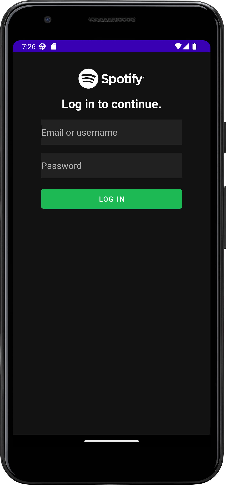
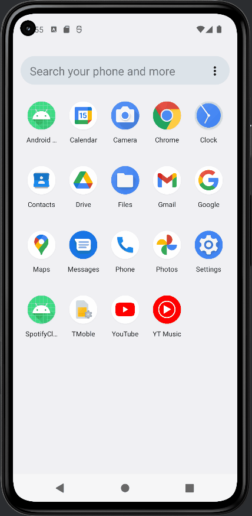

<!-- (This is a comment) INSTRUCTIONS: Go through this page and fill out any **bolded** entries with their correct values.-->

# AND101 Lab 3 - Spotify Login Screen UI

Submitted by: **Matthew Wyatt**

Time spent: **1.5** hours spent in total

## Summary

**Spotify Clone** is an android app that allows the user to enter a username and password. The app will also display a button that the user could tap after entering their information. The colors and drawables represent the branding of the Spotify app.

If I had to describe this project in three (3) emojis, they would be: **📱🎵🟢**

## Application Features

<!-- (This is a comment) Please be sure to change the [ ] to [x] for any features you completed.  If a feature is not checked [x], you might miss the points for that item! -->

The following REQUIRED features are completed:

- [x] Pick an app screenshot to duplicate
  - Be sure to add the screenshot to "Chosen Screenshot" below.
- [x] Create a runnable app that displays the Spotify Login UI
- [x] User can enter an email address or username
- [x] User can enter a password
- [x] User can see a LOG IN button

The following STRETCH features are implemented:

- [x] Logo is displayed at the top of the screen
- [x] Colors represent the app's brand

The following EXTRA features are implemented:

- [x] List anything else that you added to improve the app!

## Chosen Screenshot

I have chosen to duplicate the following layout from the **[Spotify](https://play.google.com/store/apps/details?id=com.spotify.music&hl=en_US)** app:

## Video Demo

Here's a video / GIF that demos all of the app's implemented features:

GIF created with **[ScreenToGif](https://www.screentogif.com/) for Windows**

<!-- Recommended tools:
- [Kap](https://getkap.co/) for macOS
- [ScreenToGif](https://www.screentogif.com/) for Windows
- [peek](https://github.com/phw/peek) for Linux. -->

## Notes

Here's a place for any other notes on the app, it's creation process, or what you learned this unit!

## License

    Copyright 2025 Matthew Wyatt
    
    Licensed under the Apache License, Version 2.0 (the "License");
    you may not use this file except in compliance with the License.
    You may obtain a copy of the License at
    
        http://www.apache.org/licenses/LICENSE-2.0
    
    Unless required by applicable law or agreed to in writing, software
    distributed under the License is distributed on an "AS IS" BASIS,
    WITHOUT WARRANTIES OR CONDITIONS OF ANY KIND, either express or implied.
    See the License for the specific language governing permissions and
    limitations under the License.
